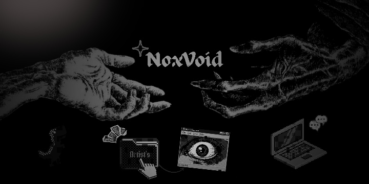
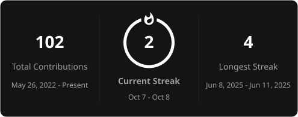

  

# Nox
<h2 align="center">Backend Developer . Linux Enthusiasts . IT Support</h2>

> I build functional, production-ready APIs and tools that make life and work easier for me. I enjoy customizing Linux and have been distro-hopping lately, exploring different environments and finding what suits my style .
>  I'm also an IT support specialist because I genuinely enjoy troubleshooting ("Not Windows"), fixing , and building systems. Outside all of that, I make art and explore whatever else catches my interest.

<h2 align="center">Connect</h2>

  
  
  
  

<h2 align="center">Tech Stack</h2>

  
  
  
  
  
  
  
  
  
  

<h2 align="center">Currently Learning</h2>

  
  
  
  
  

<h2 align="center">Github Stats</h2>

  

<h2 align="center">Activity Graph</h2>

  

<h2 align="center">Commit Activity</h2>

  

